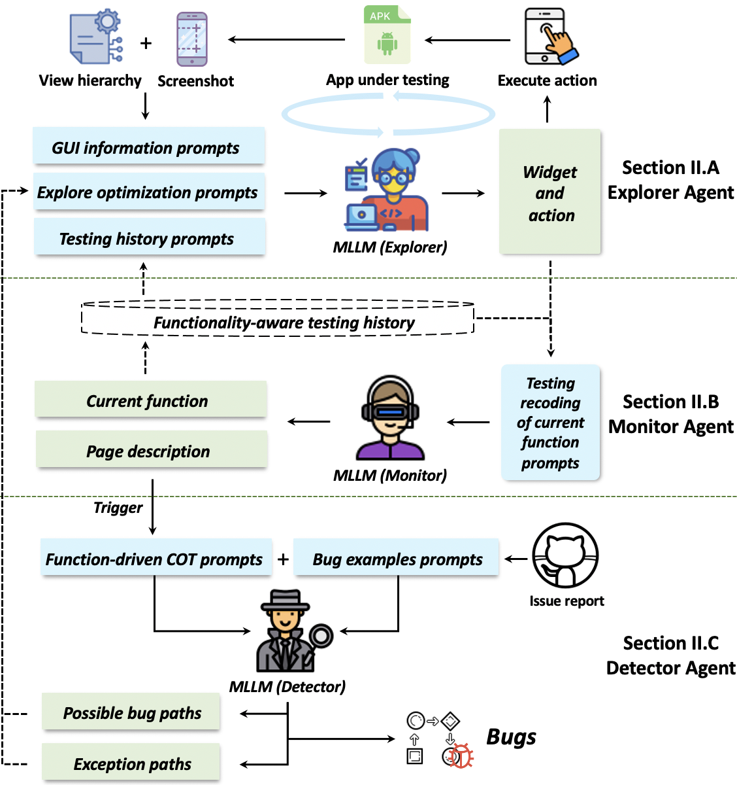

# Trident 

Trident, a novel vision-driven, multi-agent collaborative automated GUI testing approach for detecting non-crash functional bugs. It comprises three agents: Explorer, Monitor, and Detector, to guide the exploration, oversee the testing progress, and spot issues. We also address several challenges, i.e., align visual and textual information for MLLM input, achieve functionality-oriented exploration, and infer test oracles for noncrash bugs, to enhance the performance of functionality bug detection. 

## structure



# Trident Source code

## How to use
1. Generate Your API Key: Before we start working with the GPT-4 API, we need to login into OpenAI account and generate our API keys.
   `openai.api_key = "XXXXXXX"`
2. Installing the library: To work with the GPT-4 API, first, we have to install the openai library by running the following command.
3. Using “ChatCompletion” gpt-4-vision-preview, which is the same model used by GPT-4.
   
`from openai import OpenAI`

`client = OpenAI()`

`response = client.chat.completions.create(`

  `model="gpt-4-vision-preview",`

  `messages=[`

  `{`
  
      `"role": "user",`
      
      `"content": [`
      
        `{"type": "text", "text": "What’s in this image?"},`
        
        `{
         
         ` "type": "image_url",`

          `"image_url": {`

           ` "url": "https://upload.wikimedia.org/wikipedia/commons/thumb/d/dd/Gfp-wisconsin-madison-the-nature-boardwalk.jpg/2560px-Gfp-wisconsin-madison-the-nature-boardwalk.jpg",'

          `},`

        `},`

      `],`
    
    `}`

  `],`

  `max_tokens=300,`

`)`


### Requirements
* Android emulator
* Ubuntu or Windows
* Appium Desktop Client: [link](https://github.com/appium/appium-desktop/releases/tag/v1.22.3-4)
* Python 3.7
  * apkutils==0.10.2
  * Appium-Python-Client==1.3.0
  * Levenshtein==0.18.1
  * lxml==4.8.0
  * opencv-python==4.5.5.64
  * sentence-transformers==1.0.3
  * torch==1.6.0
  * torchvision==0.7.0

Use the gpt-4-v.


## This example introduces how to use GPT4-v

[a-simple-guide-to-gpt-4-api-with-python](https://platform.openai.com/docs/guides/vision)


## LLM Test

USE GPT-4 App Testing


### usage

## Install

Run the following command to install

```
pip install -Ue .
```

## Download datasets

- Injection Dataset: https://drive.google.com/drive/folders/1YeerTgkldEcIUNe2MKuBhEF6JEQKtYnc?usp=sharing
- Github Dataset: https://drive.google.com/drive/folders/1-gIaQJou7EIOe8mb2mUzTqWh7Vk8OqKe?usp=sharing

## Quick Start

## Initialize device

`python -m uiautomator2 init`

## Profile

Place the configuration file under `configs` 

## Run

```
tgpt -f configs/test.yaml
```

## View Results

`error_cases` the blue part is the part that LLM chooses to click on


### How to set up a proxy for OpenAI's API in Python?

https://github.com/Onelinerhub/onelinerhub/blob/main//python-openai/how-to-set-up-a-proxy-for-openai-s-api-in-python.md


# Motivational study

Due to space limitations in the paper, we have presented in this section the types and distribution of non crashing functional defects that we have statistically analyzed in recent years. For more details, please refer to this folder.

# Evaluation


For RQ1-2, we provide the app being tested with the apk of the baseline dataset, which you can obtain from their paper.

Sorry, we have tried uploading the APK file to GitHub but have been receiving error messages. To avoid the issue of inability to download, we have uploaded all experimental apps to Google Drive. 

Injection Dataset: https://drive.google.com/drive/folders/1YeerTgkldEcIUNe2MKuBhEF6JEQKtYnc?usp=sharing

Github Dataset: https://drive.google.com/drive/folders/1-gIaQJou7EIOe8mb2mUzTqWh7Vk8OqKe?usp=sharing

Due to the limitation of paper length, we have provided the distribution of defects in the test set and the tested apps in this section for the convenience of researchers to download. We have provided detailed experimental results for RQ3.

**ID** | **App name** | **Download** | **Category** | **Version** | **Status**
 :-: | :-: | :-: | :-: | :-: | :-: 
1 | Waze | 500M+ | map | 4.103 | fixed
2 | MEGA | 100M+ | productivity | 13.5 | fixed
3 | Swiggy | 100M+ | food | 4.61 | fixed
4 | AlfredCamera | 50M+ | house | 2024.2 | fixed
5 | LG ThinQ | 50M+ | lifestyle | 5.0.2 | fixed
6 | SmartNews | 50M+ | news | 24.7.55 | fixed
7 | Da Fit | 50M+ | sport | 2.7.7 | fixed
8 | Blinkit | 50M+ | food | 16.11.0 | fixed
9 | Bose | 5M+ | music | 10.2.4 | fixed
10 | TomTom | 5M+ | map | 9.51 | fixed
11 | ExpressPlus | 5M+ | medical | 4.12.0 | fixed
12 | Property | 5M+ | house | 5.267.0 | fixed
13 | Plant Parent | 5M+ | lifestyle | 1.76 | fixed
14 | NOS | 5M+ | news | 202405 | fixed
15 | CommBank | 10M+ | finance | 5.11.0 | fixed
16 | AIMP | 10M+ | music | 4.1 | fixed
17 | Wise | 10M+ | finance | 8.71 | fixed
18 | Smart Life | 10M+ | lifestyle | 5.15.1 | fixed
19 | Zepp | 10M+ | sport | 8.11 | fixed
20 | Hungerstation | 10M+ | food | 8.0.1 | fixed
21 | Lumosity | 10M+ | education | 2024.02 | fixed
22 | Canvas Student | 10M+ | education | 7.5.0 | fixed
23 | Khan Academy | 10M+ | education | 8.1.1 | fixed
24 | Healthengine | 1M+ | health | 10.1.11 | fixed
25 | Virgin Australia | 1M+ | travel | 2.33.0 | fixed
26 | Opal Travel | 1M+ | travel | 9.8.2 | fixed
27 | NAB  Banking | 1M+ | finance | 9.153.0 | fixed
28 | Flybuys | 1M+ | shopping | 24.7.1 | fixed
29 | Everyday Rewards | 1M+ | shopping | 24.11.0 | fixed
30 | Woolworths | 1M+ | shopping | 24.14.0 | fixed
31 | Home Assistant | 1M+ | house | 2024.5 | fixed
32 | COIN | 1M+ | lifestyle | 5.1 | confirmed
33 | Ground News | 1M+ | news | 4.15.1 | confirmed
34 | Kayo Sports | 1M+ | sport | 2.4.1 | confirmed
35 | Binge | 1M+ | entertainment | 3.3.1 | confirmed
36 | ANZ Plus | 500K+ | finance | 1 | confirmed
37 | Origin Energy Gas Internet LPG | 500K+ | house | 2.10.8 | confirmed
38 | MyRoute | 100K+ | travel | 4.2.1 | confirmed
39 | my health gov | 100K+ | medical | 24.7.1 | confirmed
40 | Simple Notes Pro | 100K+ | productivity | 6.17.0 | confirmed
41 | Linphone | 50K+ | Commun | 11.2 | confirmed  
42 | Ubank Money App | 1M+ | finance | 11.43.1 | confirmed
